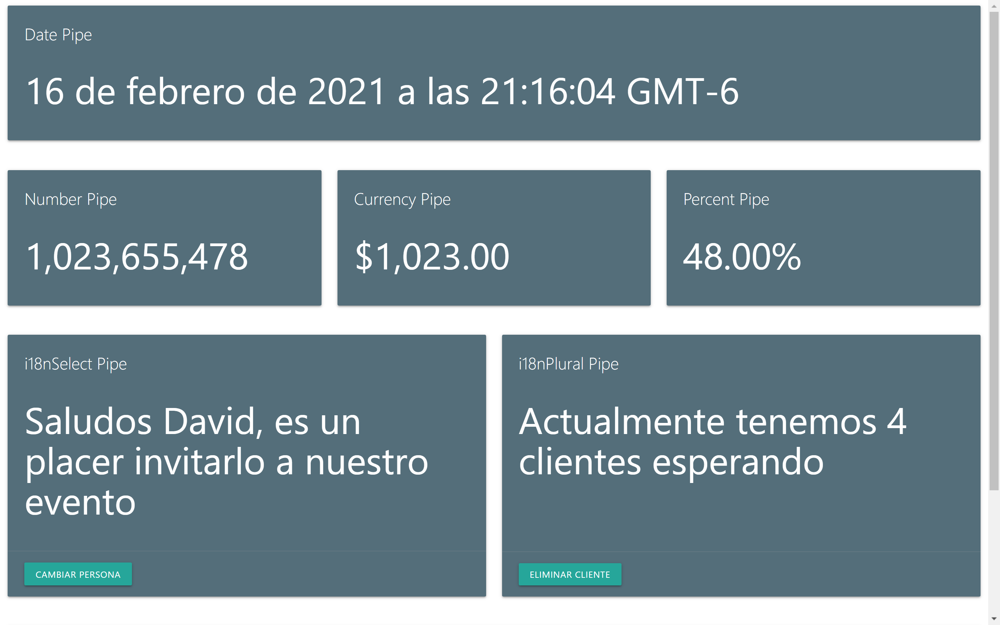

# Pipes & Directives

Practice of pipes and directives

## Preview



## Project setup

```
npm install
```

### Compiles and hot-reloads for development

```
ng serve -o
```

### Compiles and minifies for production

```
ng build --prod
```

The build artifacts will be stored in the `dist/` directory. Use the `--prod` flag for a production build.

## License

Released under the MIT License
